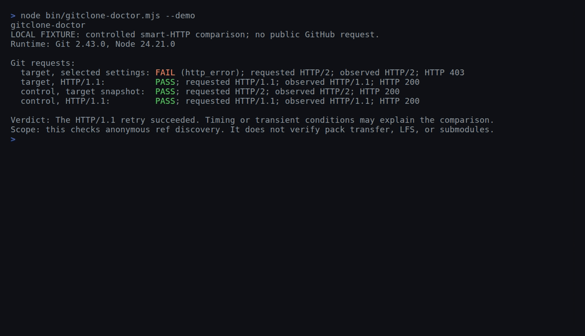

<h1 align="center">
  <br>
  gitclone-doctor
</h1>

<p align="center">
  <strong>Compare public GitHub access from your Git client with an HTTP/1.1 retry.</strong>
</p>

<p align="center">
  <a href="https://github.com/Arthur031221/gitclone-doctor/stargazers"></a>
  <a href="https://github.com/Arthur031221/gitclone-doctor/actions"></a>
  <a href="LICENSE"></a>
</p>

<p align="center">
  <a href="#quickstart">Quickstart</a> |
  <a href="#how-it-works">How it works</a> |
  <a href="#examples">Examples</a> |
  <a href="#faq">FAQ</a>
</p>

> [!TIP]
> Try the CLI from GitHub:
> ```sh
> npx --yes --package=github:Arthur031221/gitclone-doctor gitclone-doctor git/git
> ```

<p align="center">
  
</p>

## Why gitclone-doctor

When Git cannot discover refs from a public remote, DNS and TLS checks do not show how Git's HTTP transport behaved. gitclone-doctor compares the target with a known public control repository using the target's selected transport settings and an HTTP/1.1 retry.

The project grew from a [September 2026 community trace](https://github.com/orgs/community/discussions/206581) that showed a successful refs advertisement followed by a failed upload-pack request. A later reply reported builds succeeding without the workaround, so this project does not present that thread as a current GitHub incident. Its narrower check can still help decide whether an HTTP/1.1 retry changes ref discovery.

## Features

- **Compares four Git requests:** target and control repository, each with the selected settings and HTTP/1.1.
- **Freezes one transport snapshot:** the control uses settings selected for the target, including URL-matched proxy and CA settings.
- **Keeps auth material out of probes:** child Git processes do not inherit credential helpers, extra headers, askpass, or Git config overrides.
- **Requires verified TLS:** certificate checks stay enabled for the origin and HTTPS proxy, and redirects are disabled.
- **Reports observations:** JSON contains stable outcome codes, numeric response statuses, and observed protocols without raw traces or config values.
- **Checks ref discovery only:** success does not verify pack transfer, LFS, or submodules.
- **Refuses uncertain netrc state:** it will not probe when `.netrc` or `_netrc` exists or its absence cannot be established.

## Quickstart

The CLI supports macOS and Linux with Node 20 or newer and Git. The GitHub package command above is intended for the public repository. For a local checkout, run:

```sh
npm test
npm run demo
```

The demo starts a local HTTPS smart-HTTP fixture with a temporary certificate. It makes real Git requests and performs no public GitHub requests. The certificate is trusted only for that run and its key is removed afterward. The optional demo needs OpenSSL.

To probe a public repository after installing the package:

```sh
gitclone-doctor owner/repository
gitclone-doctor https://github.com/owner/repository
```

The target accepts only an owner/repository pair or a strict HTTPS GitHub repository URL. It refuses URL credentials, query strings, fragments, explicit ports, percent escapes, and extra path segments before running Git.

## Examples

`npm run demo` produces this local fixture result. The HTTP/2 403 is generated by the fixture, not by GitHub.

```text
gitclone-doctor
LOCAL FIXTURE: controlled smart-HTTP comparison; no public GitHub request.
Runtime: Git 2.43.0, Node 24.21.0

Git requests:
  target, selected settings: FAIL (http_error); requested HTTP/2; observed HTTP/2; HTTP 403
  target, HTTP/1.1:          PASS; requested HTTP/1.1; observed HTTP/1.1; HTTP 200
  control, target snapshot:  PASS; requested HTTP/2; observed HTTP/2; HTTP 200
  control, HTTP/1.1:         PASS; requested HTTP/1.1; observed HTTP/1.1; HTTP 200

Verdict: The HTTP/1.1 retry succeeded. Timing or transient conditions may explain the comparison.
Scope: this checks anonymous ref discovery. It does not verify pack transfer, LFS, or submodules.
```

For a public target, JSON output can be saved or piped to another local tool:

```sh
gitclone-doctor owner/repository --json
```

This five-line shell example keeps the tool's exit codes visible. Code 0 means selected-settings ref discovery passed, code 1 means it failed, and code 2 means setup or validation stopped the run.

```sh
target=owner/repository
gitclone-doctor "$target" --json
status=$?
if [ "$status" -eq 1 ]; then printf 'Inspect the HTTP/1.1 retry before cloning.\n'; fi
test "$status" -lt 2
```

## How it works

The tool reads the target's URL-matched transport settings once, then freezes that snapshot for all requests. Only HTTP version, proxy, CA file or directory, TLS backend, and proxy CA file are copied into the child Git environment. The HTTP/1.1 runs change only the version. The control repository uses the same snapshot so the comparison does not silently pick a different URL-specific proxy or CA.

| Request | Repository | Settings |
| --- | --- | --- |
| Target selected | Requested repository | Frozen target snapshot |
| Target HTTP/1.1 | Requested repository | Same snapshot with HTTP/1.1 |
| Control selected | `git/git` | Same frozen target snapshot |
| Control HTTP/1.1 | `git/git` | Same snapshot with HTTP/1.1 |

Each request runs `git ls-remote URL HEAD` in a neutral temporary directory with bounded output and a deadline. The process group is stopped on timeout or cancellation, and the directory is removed afterward. Git's curl trace stays in memory and is reduced to response protocol and numeric status. Proxy CONNECT protocols and statuses are kept separate from origin responses.

Git's `ls-remote` can discover refs without completing the clone's pack transfer. This check does not establish that fetch negotiation, LFS, or submodules will work. The direct DNS and TLS checks bypass configured proxies and have separate deadlines; their results do not change the Git verdict. TLS verification is forced on for Git requests and direct DNS resolves IPv4 addresses and the TLS check uses Node's default trust settings.

| Tool | What it checks | Where gitclone-doctor differs |
| --- | --- | --- |
| [GitHub Debug](https://github-debug.com/) | A manual connectivity checklist for GitHub support. | Runs Git ref discovery against a selected repository and a control repository. |
| [Network Doctor](https://github.com/heymaikol/network-doctor/blob/main/README.md) | Network layers including DNS, TCP, TLS, HTTP, and SSH paths. | Exercises Git smart-HTTP ref discovery and compares HTTP versions. |
| [`git diagnose`](https://git-scm.com/docs/git-diagnose) | Archives machine, Git client, and existing repository details for support. | Probes a selected remote without requiring an existing repository. |

<details>
<summary><b>Options and output</b></summary>

`--json` writes a stable JSON report. It contains the target repository, Git and Node versions, config-presence booleans, sanitized proxy endpoint, four probe results, direct check statuses, verdict code, and process exit code. Raw stderr, headers, traces, config values, and exception messages are not included.

`--demo` runs the local fixture. It requires OpenSSL and a Git build that can exercise HTTP/2. The demo exits successfully only after the real Git trace confirms the target's HTTP/2 403, the HTTP/1.1 ref response, and both control responses. It fails rather than substituting simulated output when those requests cannot be observed.

For public targets, exit code 0 means ref discovery passed with the selected settings. Exit code 1 means it failed, including when only the HTTP/1.1 retry passed. Exit code 2 means the input, config snapshot, proxy, runtime, or safety preflight prevented the run.

</details>

<details>
<summary><b>Credential and proxy behavior</b></summary>

Probe processes use a rebuilt environment, ignore system and global Git config, clear credential helpers and extra headers, disable askpass and prompts, and force certificate verification. Only the selected transport settings are copied from the target snapshot. Proxy credentials, query strings, fragments, malformed proxy URLs, and SOCKS proxies are refused. An unauthenticated HTTP or HTTPS proxy is passed through the child config environment; a selected `no_proxy` value is retained.

The tool checks `.netrc` and `_netrc` with `lstat` before each Git request. It never reads those files. If either exists, or its absence cannot be established, the network probe stops with exit code 2. A file created or replaced during a run remains a race the check cannot eliminate.

The comparison does not change `HOME`, global Git config, or the user's working tree. A later `git clone` command uses the user's normal Git configuration.

</details>

<details>
<summary><b>CI</b></summary>

The workflow runs offline tests on Node 20, 22, 24, and 26. It also packs the project, installs it in a directory outside the checkout, and runs the installed command's help output.

</details>

<details>
<summary><b>FAQ</b></summary>

### FAQ

**Does a passing result guarantee that clone works?** No. It checks ref discovery, not pack transfer, LFS, or submodules.

**Does it use my credentials?** The probe is anonymous. Helpers, askpass, and configured extra headers are excluded. Git's libcurl can consult a netrc file, so the tool refuses when `.netrc` or `_netrc` exists or cannot be checked.

**Why can the verdict be unresolved?** A shared failure can come from network routing, filtering, or a GitHub edge. The four requests report observations and do not assign a cause when they cannot separate them.

**Does it support every proxy?** The first release supports unauthenticated HTTP and HTTPS proxies. It refuses credentials and SOCKS proxy schemes.

</details>

## Contributing

Run `npm test` before opening a change. The test suite uses Node's built-in test runner and a local smart-HTTP fixture. For code changes, keep reports limited to sanitized enums and add assertions for any new outcome. See [CONTRIBUTING.md](CONTRIBUTING.md) and the [issue tracker](https://github.com/Arthur031221/gitclone-doctor/issues).

## License

MIT. See [LICENSE](LICENSE).
